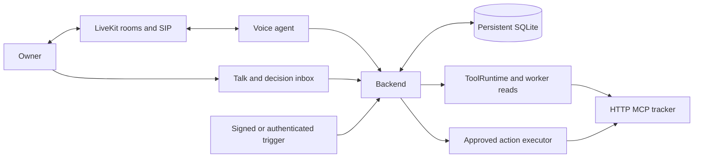

# toad

**Iris** is a configurable voice assistant that investigates a developer issue while its owner is away. It drafts one evidence-backed comment for the owner to approve, then publishes exactly the approved revision. LiveKit carries the browser conversation and the outbound phone call. A small persistent backend owns the work, permissions, decisions and result receipts.

This is a three-developer MVP for a 48-hour event. It is a supervised demo deployment, not a production service.

> **Status:** planning. The implementation has not started yet. [`toadPlan.master.md`](toadPlan.master.md) is the final scope and shared source of truth. Features not listed there are outside this MVP.

## How it works

The demo follows one bug from arrival to a confirmed comment:

1. A signed issue event, an authenticated demo button or a spoken delegation creates durable work.
2. The worker reads the issue and a fixed code snapshot, drafts a short reply and links the evidence.
3. The owner sees the exact comment, target and evidence in the web inbox.
4. A decision that can trigger a call first rings in the web app. If nobody answers, Iris places one outbound call and asks the owner to authenticate with a PIN before revealing any private detail.
5. The owner can edit the comment. Iris creates a replacement revision, reads it back in full and waits for an explicit approve or deny.
6. The executor submits that approved revision and shows a confirmed receipt. Lost responses are reconciled, and uncertain outcomes stay visible.

The issue and code evidence are disclosed, seeded fixtures in a controlled tracker. The MCP reads, model investigation, owner decision, phone call and comment publishing are all live.

## Scope

**Included**

- One owner, one assistant, one deployment and one controlled HTTP MCP tracker.
- YAML configuration for name, persona, voice and models, registered read and propose capabilities, work budgets and outbound contact opt-in.
- Browser voice and text conversation, with delegation, current work, precise cancellation and progress summaries.
- Three reads (`tracker/get_issue`, `tracker/search_issues`, `tracker/read_context`) and one external mutation (`tracker/create_comment`).
- Persistent jobs, immutable proposal revisions, web Edit/Approve/Deny, phone authentication, full voice read-back and one executor.
- A Talk view plus a decision inbox, YAML validate and save, polling for current state, and links to evidence and published results.
- One web-to-phone outreach attempt per approval, a global call cap, restart recovery and targeted fault tests.

**Deferred:** cron, inbound phone numbers, real Linear/GitHub integration, OAuth, arbitrary stdio/filesystem/shell access, freeform memory, Slack, handoffs, discovery, video, multiple actions per job, quiet hours, snooze/digests, SSE, config rollback UI, distributed workers and production isolation.

Outbound calling is off by default. It is enabled only for the verified presenter and the configured demo trigger.

## Architecture



- **Voice agent:** holds model and LiveKit credentials plus a restricted backend credential. It has no MCP credentials and never performs external writes.
- **Backend:** one replica with one Uvicorn worker, backed by SQLite (WAL, foreign keys, busy timeout) on a persistent volume. Database records act as the queue and the source of truth: pending approvals are the execution queue and outreach rows are the contact queue.
- **Reads:** the worker and the voice agent both go through the same backend ToolRuntime. The model receives read and proposal descriptors only, with no callable write handle.
- **Writes:** only the executor calls `create_comment`, using the stored immutable action and an idempotency key it injects. The tracker returns a receipt that the executor verifies before marking the action as succeeded.

## Repository layout (planned)

| Directory | Owner | Purpose |
| --- | --- | --- |
| `dot-agent/` | Dev A | Voice agent, backend client, confirmation, phone |
| `backend/` | Dev B | API, policy, worker, executor, outreach, migrations |
| `web/` | Dev C | Talk view, decision inbox, settings |
| `demo-tracker/` | Dev C | HTTP MCP tracker, seeded evidence, comments, receipts |
| `shared/` | Dev B | Canonical config and records |
| `contracts/` | Dev B | OpenAPI, checked fixtures, `compatibility.md` |
| `configs/` | Dev B (schema), Dev C (demo profile) | Validated assistant profiles |
| `personas/` | Dev A | Bundled persona files |
| `scripts/` | Each author | Test and rehearsal helpers |

## Team

| Developer | Owns | Plan |
| --- | --- | --- |
| Dev A | LiveKit voice agent, backend client, deterministic confirmation, DTMF collection, AMD/SIP lifecycle, cleanup, agent deployment | [`toadPlan.dev-A.md`](toadPlan.dev-A.md) |
| Dev B | Schemas and contracts, owner and agent auth, ToolRuntime, jobs and worker, approvals and executor, outreach, backend deployment | [`toadPlan.dev-B.md`](toadPlan.dev-B.md) |
| Dev C | Web client, controlled MCP tracker, evidence fixtures, telephony provider setup, integration harness, presentation and fallback recording | [`toadPlan.dev-C.md`](toadPlan.dev-C.md) |

## Configuration

Assistant profiles are strictly validated YAML. Each save creates an immutable, active revision. The backend deployment registry fixes tracker URLs, credentials and phone numbers, so YAML cannot supply arbitrary URLs, commands, credentials or destinations.

```yaml
schema_version: 1
id: iris
name: Iris
persona: personas/iris.md
voice:
  stt: <verified provider/model>
  llm: <verified fast model>
  tts: <verified provider/voice>
worker:
  llm: <verified tool-capable model>
  max_steps: 12
  max_tool_calls: 20
  max_wall_s: 90
  max_llm_tokens: 12000
  max_parallel_jobs: 2
tools:
  - id: tracker
    connection: demo-tracker
    expose: [get_issue, search_issues, read_context]
    propose: [create_comment]
    scope: { project_ids: [demo-project] }
    timeout_s: 10
    comment_max_chars: 600
results: { max_model_chars: 8000, max_artifact_bytes: 65536 }
triggers:
  - id: new-issue
    webhook: /hooks/tracker
    call_eligible: false
    task: Investigate the issue and draft one evidence-backed reply
reach:
  phone_enabled: false
  owner_number_env: OWNER_PHONE
  escalate_after_s: 120
  max_attempts_per_approval: 1
  max_calls_per_hour: 2
approvals: { ttl_s: 1800, voice_max_chars: 600 }
```

Model and voice IDs are placeholders until they are verified during setup and recorded in `contracts/compatibility.md`.

## Safety guarantees

- A comment is published only after an explicit approval of the exact revision and digest the owner saw or heard.
- A voice approval requires a completed, uninterrupted read-back of the full comment. An early, ambiguous or unrelated "yes" does not count.
- Editing a comment creates a new revision with a new action ID and requires a fresh read-back.
- The first valid decision across web and voice wins. Stale, expired, superseded or unauthenticated decisions publish nothing.
- Cancellation or policy revocation that lands before the submission gate prevents any external call.
- The tracker stores comments idempotently by action ID, so retries after a lost response return the same receipt instead of creating a duplicate.
- Phone sessions reveal nothing private until the backend verifies the PIN. PINs never reach model input, transcripts or logs.

## Milestones

| Hours | Gate |
| --- | --- |
| 0–2 | **G0:** versions and contracts recorded, browser voice turn works, outbound call attempted |
| 2–6 | **G1:** durable seeded job and decision, live tracker probe, telephony trunk decision |
| 6–16 | **G2:** live investigation → web decision → exact verified comment; duplicate and restart tests |
| 16–28 | **G3:** authenticated phone edit → fresh read-back → exact receipt; failures leave the inbox intact |
| 28–40 | **G4:** critical negative and fault cases pass; config demo works |
| 40–48 | **G5:** two clean full rehearsals and a usable web fallback |

Features freeze at hour 40, and deploys freeze one hour before judging.

## Demo (four minutes)

1. Show the YAML and explain what Iris does.
2. Inject the labeled seeded bug and show live reads with evidence links.
3. Show the drafted comment and let the web invitation time out.
4. Answer the phone, enter the PIN and hear the issue plus the full comment.
5. Ask for an edit, hear the full replacement, approve it and show the tracker receipt.
6. Start a slow investigation and cancel it by voice.
7. Switch to an alternate name and voice, then remove `create_comment` and show the backend refusing a new request.
8. Show the evidence, revision, decision and confirmed receipt together.

If the phone path fails, the same decision is completed from the web inbox. A clean recorded phone run, clearly labeled as recorded, is the final fallback.

## Definition of done

The MVP is complete when:

- the exact approved comment is verifiably published;
- denied, stale and unauthenticated decisions publish nothing;
- the critical restart, race and lost-response tests pass;
- the config demonstration works;
- the frozen build has two successful rehearsals.

If the phone dependency fails, that failure is declared and the web fallback remains complete.

## Documentation

- [`toadPlan.master.md`](toadPlan.master.md): full scope, API routes, record schemas, approval rules, tracker contract, phone lifecycle and test matrix
- [`toadPlan.dev-A.md`](toadPlan.dev-A.md), [`toadPlan.dev-B.md`](toadPlan.dev-B.md), [`toadPlan.dev-C.md`](toadPlan.dev-C.md): per-developer implementation plans

Key external references: [LiveKit Agents](https://github.com/livekit/agents/releases), [LiveKit MCP integration](https://docs.livekit.io/agents/logic/tools/mcp/), [outbound calls](https://docs.livekit.io/telephony/making-calls/outbound-calls/), [answering machine detection](https://docs.livekit.io/telephony/features/answering-machine-detection/), [DTMF collection](https://docs.livekit.io/agents/prebuilt/tasks/get-dtmf/), [MCP tool spec](https://modelcontextprotocol.io/specification/2025-06-18/server/tools) and [SQLite WAL](https://www.sqlite.org/wal.html).
