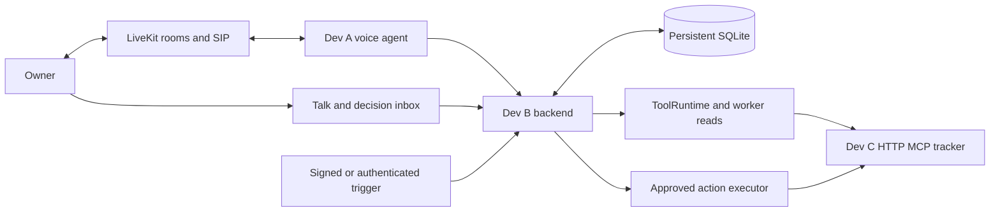

# LiveKit assistant MVP master plan

September 30, 2026 · 48 hour event · Three developers

Build Iris, a configurable assistant that investigates a developer issue while the owner is away, presents one evidence-backed comment for approval, and publishes exactly the approved revision. LiveKit carries the conversation and outbound phone call. A small persistent backend owns the work, permissions, decisions and result receipts.

This document is the final scope and shared source of truth. The [Dev A plan](toadPlan.dev-A.md), [Dev B plan](toadPlan.dev-B.md) and [Dev C plan](toadPlan.dev-C.md) divide its implementation. Earlier review documents remain background; features absent from this plan are outside this MVP. The schedules are elapsed event hours, with rest rotated after the first integrated gate.

## Product and scope

The demo follows one bug from arrival to a confirmed comment. The issue and code evidence are disclosed seeded fixtures in a controlled tracker; the MCP reads, model investigation, owner decision, phone call and persistent comment mutation are live.

The essential experience is:

1. A signed issue event, authenticated demo button or spoken delegation creates durable work.
2. The worker reads the issue and a fixed code snapshot, drafts a short reply and links the evidence.
3. The owner sees the exact comment, target and evidence in the web inbox.
4. A call-eligible decision rings in the web app. If unanswered, one outbound call asks the owner to authenticate before any private detail is disclosed.
5. The owner edits the comment. Iris creates a replacement revision, reads it in full and accepts an explicit decision.
6. The executor submits that approved revision and displays a confirmed receipt. Lost responses are reconciled; uncertain outcomes remain visible.

**Included**

- One owner, one assistant, one deployment and one controlled HTTP MCP tracker.
- YAML configuration for name, persona, voice/models, registered read/propose capabilities, bounded work and outbound contact opt-in.
- Browser voice/text conversation; delegation, current work, precise cancellation and progress summaries.
- Three reads: `tracker/get_issue`, `tracker/search_issues`, `tracker/read_context`. One external mutation: `tracker/create_comment`.
- Persistent jobs, immutable proposal revisions, web Edit/Approve/Deny, phone authentication, complete voice read-back and one executor.
- Talk plus a decision inbox; plain YAML validate/save; polling for current state; evidence and external result links.
- One web-to-phone outreach attempt per logical approval, a global call cap, restart recovery and targeted fault tests.

**Deferred**

Cron, inbound phone numbers/calls, real Linear/GitHub integration, OAuth, arbitrary stdio/filesystem/shell access, freeform memory, Slack, handoffs, discovery, video, multiple actions per job, quiet-hour scheduling, snooze/digests, SSE, config rollback UI, distributed workers and production isolation. Start these only after the event or an explicit scope change.

This is a supervised demo deployment. Outbound calling is disabled by default and enabled only for the verified presenter and configured demo trigger. Autonomous scheduled outreach is outside scope.

## Ownership and architecture

| Developer | Owns | Key handoff |
| --- | --- | --- |
| Dev A | LiveKit voice agent, backend client, deterministic confirmation, restricted DTMF collector, AMD/SIP lifecycle, cleanup, agent deployment | Session/auth/read-back integration with B; real call rehearsal with C |
| Dev B | Canonical schemas/contracts, owner and agent auth, ToolRuntime, jobs/worker, approvals/executor, persisted outreach, backend/store/deployment | Checked API fixtures to A/C; tracker schema and receipt contract with C |
| Dev C | Web client, controlled MCP tracker, evidence fixtures, provider setup, integration harness, presentation and fallback recording | Tracker and receipt lookup to B; provider/account readiness and demo flow to A |



The voice agent holds model/LiveKit credentials and a restricted backend credential. It holds no MCP credentials and never performs external writes. Worker and voice reads use the same backend ToolRuntime and canonical resource service. The model receives trusted read/proposal descriptors, with no callable write handle.

Run one backend replica with one Uvicorn worker and one application lifespan owner for background loops. Use SQLite WAL, foreign keys, a busy timeout and a persistent local volume. Keep transactions short; perform network calls outside them. The tracker has its own persistent tables/database on the same host and is reachable through a fixed registered HTTP endpoint.

Database records are the queue and source of truth. Commit a state change and its event/work intent together. Pending approval rows are the durable execution queue; outreach rows are the durable contact queue. A separate generic outbox framework is unnecessary for v1. These application modules share a process; this is not isolation against compromised backend code.

## Repository and initial setup

```text
dot/
  dot-agent/                 # A: voice, backend client, confirmation, phone
  backend/                   # B: API, policy, worker, executor, outreach, migrations
  web/                       # C: Talk, inbox, settings
  demo-tracker/              # C: HTTP MCP, seeded evidence, comments, receipts
  shared/                    # B: canonical config and records
  contracts/                 # B: OpenAPI, checked fixtures, compatibility matrix
  configs/                   # B owns schema; C owns validated demo profile
  personas/                  # A owns bundled persona
  scripts/                   # test/rehearsal helpers, each owned by its author
```

By hour two, pin the tested Agents/provider plugins/MCP SDK versions, CLI version and starter commits; commit lockfiles. Record actual model/voice IDs, provider auth, project deployment capabilities and region in `contracts/compatibility.md`. Examples below define the application contract; they are not claims that an implementation already exists.

Deploy the HTTPS backend immediately. C begins the provider account/trunk setup in hour one, time-boxes it to two hours, and verifies the presenter number. A and C attempt a manual outbound call before hour six. Do not rent an inbound number for this MVP.

## Configuration

Save safely parsed, strictly validated YAML as an immutable revision. Activation is part of a successful save. Name/persona/voice/model choices apply on the next session; current policy can revoke reads or writes immediately. A capability must be permitted by both the job/session snapshot and current active policy. New grants require a new session; revoked grants block future submission.

```yaml
schema_version: 1
id: iris
name: Iris
persona: personas/iris.md
voice:
  stt: <verified provider/model>
  llm: <verified fast model>
  tts: <verified provider/voice>
worker:
  llm: <verified tool-capable model>
  max_steps: 12
  max_tool_calls: 20
  max_wall_s: 90
  max_llm_tokens: 12000
  max_parallel_jobs: 2
tools:
  - id: tracker
    connection: demo-tracker
    expose: [get_issue, search_issues, read_context]
    propose: [create_comment]
    scope: { project_ids: [demo-project] }
    timeout_s: 10
    comment_max_chars: 600
results: { max_model_chars: 8000, max_artifact_bytes: 65536 }
triggers:
  - id: new-issue
    webhook: /hooks/tracker
    call_eligible: false
    task: Investigate the issue and draft one evidence-backed reply
reach:
  phone_enabled: false
  owner_number_env: OWNER_PHONE
  escalate_after_s: 120
  max_attempts_per_approval: 1
  max_calls_per_hour: 2
approvals: { ttl_s: 1800, voice_max_chars: 600 }
```

The backend deployment registry fixes the tracker URL, account/project identity, transport, read token and executor token. YAML cannot supply arbitrary URLs, commands, credentials or target numbers. Persona paths are bundled and allowlisted. Secrets are component environment settings; dispatch metadata contains references only.

Reject duplicate YAML keys, unknown fields, unsupported schema, unknown connection/tool, expose/propose overlap, invalid scopes/budgets and oversized content. Probe installed models/voices and tracker schemas before accepting a profile. Save uses `expected_config_revision` so simultaneous edits conflict. Appearance-only changes preserve unchanged pending actions; connector/schema/scope/capability changes invalidate affected approvals.

C maintains a prevalidated demo profile: phone enabled, seeded trigger call-eligible, 20-second escalation, and at most 30 words in the draft/40 words in the edited comment. B validates the alternate voice profile before judging. Config save must never fall back to a permissive default in a deployed session.

## Shared records and API contract

Dev B owns these names and generates checked OpenAPI/fixtures. A and C build against them; any breaking change updates schema, fixtures and clients together. All times are UTC. Application job/session/approval/action/outreach IDs are backend-generated and opaque; delivery IDs and tracker issue/evidence identities come from their authenticated source.

| Record | Essential fields |
| --- | --- |
| Config | `config_revision`, validated YAML/resolved data, persona/schema/connection hashes, active flag |
| Trigger delivery | Source and unique `delivery_id`, issue/version, normalized context and associated job |
| Job | `job_id`, source/work key, task/context, `config_revision`, state, version, lease/deadline, cancellation flag, summary, budget usage |
| Approval revision | Stable `approval_id`, `revision`, `supersedes_revision`, fresh `action_id`, immutable envelope/digest, state, expiry, actor/session/channel |
| Execution | `action_id`, attempt, `submission_started_at`, state, error, receipt |
| Outreach | `outreach_id`, stable approval lineage, current revision, state/deadline, session/room/dispatch/SIP references, attempt/outcome |
| Session | `session_id`, owner/room/config binding, mode, auth state/expiry, spoken event cursor |
| Event | Monotonic `event_id`, kind, time, correlation IDs, bounded typed payload |

Use `(approval_id, revision)` as the immutable revision key. Each edited revision gets a fresh action ID. The owner capability and attempt cap follow the logical approval lineage; read-back and consent follow a specific revision and digest.

**Routes**

| Route | Caller | Contract |
| --- | --- | --- |
| `POST /auth/login`, `POST /auth/logout` | Owner | Single-owner server login/logout; secure session cookie; no public registration |
| `GET /snapshot?after_event_id=N` | Owner or verified scoped agent | Current jobs/approvals/outreach plus bounded newer event tail and `latest_event_id`; agent also gets ordered pending final results from its stored delivery cursor; events are hints, current records are authoritative |
| `POST /sessions` | Owner | `{mode: web|approval_call, approval_id?}`; B binds owner/config/room, dispatches and returns session/room/token |
| `GET /sessions/{session_id}` | Bound agent | Generic phone startup context before auth; full permitted context after owner verification |
| `POST /sessions/{session_id}/phone-auth` | Restricted phone adapter | Collected DTMF digits; B verifies with timeout/attempt limit; returns session/lineage-bound owner capability |
| `POST /sessions/{session_id}/delivery-cursor` | Verified scoped agent | Monotonic acknowledgement after complete spoken result playout; no advancement on interruption |
| `POST /tools/read` | Worker or verified scoped agent | `{tool_ref, args, job_id?}` with session binding for agent; B validates current/snapshot scope and schema |
| `POST /jobs` | Owner or verified scoped agent | Task/context plus `Idempotency-Key`; returns durable job ID/state before work starts |
| `POST /jobs/{job_id}/cancel` | Owner or verified scoped agent | `{expected_version}`; durable result, including too-late submission status |
| `POST /hooks/tracker` | Signed tracker sender | HMAC over raw body, source `delivery_id`, resource ID/revision; acknowledge only after durable enqueue |
| `POST /approvals` | Worker or verified scoped agent | `{job_id, tool_ref, args, reason, source_refs}` plus request key; backend constructs envelope and preview |
| `POST /approvals/{approval_id}/revisions` | Owner or verified scoped agent | `{expected_revision, body}`; supersedes pending revision, transfers active confirmation lease |
| `POST /approvals/{approval_id}/readback` | Verified bound voice adapter | `{revision, digest, phase: start|complete|interrupt, ticket_id?}`; only complete audio playout enables voice decision |
| `POST /approvals/{approval_id}/decision` | Owner or verified voice session | `{revision, digest, decision: approve|deny, readback_ticket_id?}`; backend derives actor/channel and conditionally accepts one decision |
| `POST /outreach/{outreach_id}/accept` | Owner | Conditional web claim/cancel phone escalation, return confirmation session |
| `POST /outreach/{outreach_id}/status` | Bound agent | Call lifecycle outcome/reference update; cannot authorize a decision |
| `GET /configs/iris`, `POST /configs/validate`, `PUT /configs/iris` | Owner | Load, validate and save YAML with expected config revision; return errors or active immutable revision |

The demo button uses the signed tracker-event fixture through a server-side helper, or `POST /jobs` with an explicit authenticated fixture context. It never grants itself phone eligibility; B derives that from the configured trigger/profile. Session mode `approval_call` requests made by the web owner carry no phone destination.

Return errors as `{code, message, retryable, correlation_id, current_revision?}`. Stale revision/digest/state and reused idempotency key with different content return 409. A retry with the same key/body returns the existing result. Agent credentials cannot forge owner actor/channel fields.

Before PIN verification, phone session APIs permit only generic startup, auth and contact status/cleanup. Deny private snapshot, tools, jobs, proposals, edits, cancellation and approval data. Worker service permissions are independent. Use HTTPS, one owner login, secure cookies, CSRF/origin checks, strict CORS and room-scoped expiring browser tokens. PINs are verified against a backend-side hash and excluded from model input, transcripts and logs.

After verification, a phone snapshot is restricted to its bound approval lineage/job. A verified browser owner session can access the owner's work. Read each snapshot and its event watermark in one short database transaction; do not treat a capped event tail as a complete delivery history.

## Worker and state polling

Ingest signed events with a unique `(source, delivery_id)` and an issue/version work key. Queue distinct issues rather than dropping all events while a trigger is busy. Duplicate delivery maps to the same job. Bound queue depth and return a retryable overload response instead of acknowledging lost work.

The worker claims a job with a lease and snapshot, runs at most two jobs, and executes only registered reads. Append each model tool call and matching result according to the chosen provider protocol. Keep issue/trigger/tool text labeled as untrusted data; it cannot change persona or permission. Capture source/version and truncation flags, retain bounded redacted artifacts, and pass only a smaller projection to the model. Reuse connections and parallelize at most two independent reads.

Check cancellation, deadline and remaining token/step/tool budgets before each step and before proposal creation. Cap output per model call so the final bounded request cannot run without limit. V1 stops investigation at one proposed comment or a grounded no-action summary; it does not resume a general model loop after consent.

Jobs follow `queued -> running -> awaiting_approval -> executing -> succeeded`. No-action work may finish `running -> succeeded`. Alternatives include `denied`, `expired`, `cancelled`, `failed`, `budget_exceeded` and reconcilable `outcome_unknown`. The job resolves from its one action outcome; it must not remain awaiting approval after execution finishes.

Use snapshot polling rather than SSE in the MVP. The web polls once per second while active and backs off when hidden/disconnected. A following agent polls every two seconds. Snapshots include current records even if an event tail was missed, so refresh/reconnect restores correct state. Cap history returned and deduplicate by event ID. Polling is lightweight application IO; it never launches a model call merely to check status.

**Voice tools**

| Model tool | Behavior |
| --- | --- |
| `call_read_tool` | Calls a qualified read through B's validation/runtime; no raw MCP access |
| `delegate` | Immediately acknowledges, then creates/follows a durable job using an adapter-generated stable request key |
| `list_background_jobs` | Reports authoritative current permitted work from the snapshot |
| `cancel_background_job` | Cancels the discussed named job; reports the submission gate outcome |
| `propose_action` | Proposes one comment for a bound running job that has no existing proposal; backend validates and conditionally transitions that job |
| `get_decision` | Reads the current permitted approval revision/status from the snapshot |

Spoken requests to publish first create/delegate a job. A job can transition to its first proposal only once; a worker/agent race is rejected rather than creating two lineages. Further edits use the revision API. These six tools are the canonical names used by A's session catalog; deterministic phone authentication and read-back are adapter control flow, not arbitrary model-authorized operations.

Iris acknowledges delegated work promptly, speaks milestones at most every five seconds, and queues progress while a confirmation has the floor. Process pending final results in event-ID order and advance the session delivery cursor only after complete playout, without skipping an older undelivered result. Work and receipts persist across calls; a dropped call can make speech delivery uncertain, so correctness comes from the inbox rather than a universal exactly-once speech promise.

## Approval and execution rules

The backend generates the exact target/comment preview. It validates normalized arguments and hashes the full immutable envelope: approval/action/job/config IDs, revision, tool and schema identity, connection/account, target/args, evidence/issue revision and expiry. Preserve comment bytes; do not inject execution-time defaults. Reject unknown JSON fields, duplicate keys and invalid targets. Secrets remain outside the envelope.

1. Web approval binds to the displayed revision/digest. Voice approval additionally requires a completed ticket for that revision, session and owner capability.
2. Read-back states the issue target and full short comment using deterministic text. A model explanation cannot replace or shorten the consequential content.
3. The audio must finish before asking for approval. Interruption, editing or disconnect clears completion. Ambiguous intent gets clarification; unrelated/early yes is not consent.
4. An edit conditionally supersedes the pending revision and creates a fresh action. Keep the same call/authenticated owner lineage, transfer its lease, and require a fresh full read-back.
5. The first valid conditional decision wins across web/voice. Stale, expired, superseded, already resolved or unauthenticated decisions enqueue no write.
6. The executor claims an approved action, records an attempt, and then competes atomically with cancellation/current-policy revocation to set `submission_started_at`. This is the submission gate.
7. Cancellation that wins before the gate prevents any external call. After the gate, report that submission may be in flight; completed effects cannot be cancelled or silently undone.
8. Call only the stored immutable action. Store a verified receipt/content digest before marking succeeded. Wait up to 30 seconds in a call, then fetch and report authoritative state rather than assuming completion or failure.

The controlled tracker atomically stores `action_id`, normalized request digest and comment in one transaction. Same key/content returns the same receipt; same key/different content conflicts. The executor injects the trusted action ID; the model does not select an execution key. A genuinely new action has a new ID even if its comment text matches an earlier one.

On timeout/crash after possible submission, use `outcome_unknown` and lookup the stored action receipt. The controlled tracker permits safe retry with the same key only while owner consent, expiry and current policy still authorize a new submission. Receipt lookup remains permitted for reconciliation after revocation; it does not grant permission to publish a missing comment. Any future connector without reliable idempotency/reconciliation must remain unknown until reviewed; there is no universal exactly-once MCP guarantee.

Issue/evidence revision checks are enforced atomically by the controlled tracker before creating the comment. Receipt existence is checked first on an idempotent retry. If the issue changed before a new write, invalidate the stale proposal and return it for fresh investigation/review.

## Tracker contract

Dev C builds a small HTTP MCP server from locked SDK versions. B owns the canonical schemas; C implements them and provides live test fixtures.

| Tool | Arguments and result |
| --- | --- |
| `get_issue` | `{issue_id}` -> project/issue ID, title/body, integer revision and owner-accessible URL |
| `search_issues` | `{query, limit}` -> bounded issue summaries; clamp limit to 20 |
| `read_context` | `{issue_id}` -> fixed repository snapshot ID, bounded file excerpts, evidence IDs/URLs and revision |
| `create_comment` | `{issue_id, body, expected_issue_revision, action_id}` -> immutable receipt with comment ID/URL, action ID and request/content digest |

`expected_issue_revision` is required in the stored proposal. `action_id` is an executor-injected reserved argument; the trusted model proposal schema exposes only issue ID, text and expected issue revision. Both contribute to the backend action digest. C's backend-only `GET /receipts/{action_id}` supplies reconciliation. Owner-accessible comment/evidence pages render escaped content and use the same owner-authenticated app gateway; do not expose private fixture details on unauthenticated URLs.

Use a read token that cannot mutate and an executor token for `create_comment`/receipt lookup. Add a commit-then-drop-response test hook, disabled during normal operation and judging. Enable the eight-second read delay only for the explicit second demo/test fixture. Keep seed/reset operations developer-only; they never become model tools.

Each intentional rehearsal/demo run gets a fresh issue ID or issue revision/work key. Reusing only a new delivery ID for identical issue/version data can correctly deduplicate the investigation. Run three phone rehearsals across the hourly cap windows, and reserve call capacity for judging; do not bypass the production contact cap to rehearse.

## Outreach and phone lifecycle

The backend stores one outreach lineage and deadline when a call-eligible approval is created. Only the validated trigger/profile sets eligibility. Routine/manual delegated work stays in the inbox. B schedules contact; A dials; C provisions the provider and verified destination.

States are `web_ringing`, `web_connected`, `phone_scheduled`, `phone_dialing`, `phone_connected`, `finished`, `unreachable` and `cancelled`. Web accept, decision, edit, expiry and phone scheduling compete through conditional backend updates. Claim at most one active conversation per approval; an edit transfers the current call and never resets its attempt cap.

Before each transition, recheck current pending revision, expiry, phone opt-in, verified destination and hourly cap. Outbound disabled by default; at most one attempt per approval and two per hour. Normal no-answer/busy/voicemail/auth failure leaves the approval pending. There is no blind redial. Persist known room/dispatch/participant IDs and reconcile ambiguous dial/dispatch requests before considering another operation.

For a phone attempt, A:

1. Resolves only the backend-bound session and destination authorization.
2. Attaches/starts room audio with greetings disabled and arms AMD for the intended SIP participant before dialing.
3. Uses `wait_until_answered`, bounded ringing/detection/auth waits, and no automatic IVR navigation.
4. Hangs up without details for detected machine/IVR/unavailable. Human or uncertain detection permits only a generic identity/auth prompt.
5. Collects keypad events outside model input/transcripts; B verifies the PIN with at most three attempts and a 30-second deadline.
6. Fetches private current approval/context only after verification, performs read-back/edit/decision, and reports authoritative execution status.
7. Ends/reclaims room/session resources on every success, error, disconnect or stale-decision path. Cleanup is idempotent and is not left solely to a model-callable end tool.

If the phone identity/private-data gate cannot be made reliable, phone becomes a generic invitation to the authenticated web inbox. The web approval path remains fully functional. Caller ID, SIP pickup and AMD do not establish owner identity.

## Build gates

| Hours | Dev A | Dev B | Dev C | Required gate |
| --- | --- | --- | --- | --- |
| 0 to 2 | Browser voice turn, SDK/phone capability probe | HTTPS health, canonical schemas, initial fixtures | UI scaffold, tracker schema, provider setup | G0: recorded versions/contracts and voice turn; outbound attempted |
| 2 to 6 | Core client against checked fixtures; audio/auth spike | Persistent store, session/job/approval APIs, owner auth | Live tracker reads/idempotent comment, seed data, basic card | G1: durable seeded job/decision, live tracker probe, trunk decision |
| 6 to 16 | Live delegation, status/cancel, web voice read-back | ToolRuntime/worker, decision revisions/CAS, executor/gate, snapshot | Inbox exact preview/Edit/Approve/Deny/receipt; integration harness | G2: live investigation -> web decision -> exact verified comment; duplicate/restart tests |
| 16 to 28 | PIN/private gate, AMD/SIP/edit lifecycle | Outreach arbitration, voice tickets/auth, lost-response recovery | Phone/web race rehearsal, config save and alternate profile | G3: authenticated phone edit -> fresh read-back -> exact receipt; failures retain inbox |
| 28 to 40 | Speech/cancel/disconnect tests and latency | Recovery, budgets, revocation/fault tests, deployment checks | Refresh/unknown UI, measured rehearsals, reset/recording | G4: critical negative/fault cases pass; config demo works |
| 40 to 48 | Fixes and rehearsal | Fixes, backup, known-good build | Frozen demo, recording and fallback | G5: two clean full rehearsals and usable web fallback |

At G0 agree names/schema, not every implementation detail. At G1 connect to the real backend; fixture mocks remain test helpers. If G2 slips, freeze feature work and pair on the failing transition. Defer all listed optional features. If the provider is blocked at G1, continue the complete web path and retain phone as the desired path only when its dependency clears before feature freeze.

For a 24-hour event, use the same narrow scope: G1 by hour four, G2 by hour ten, phone decision by hour 16, freeze at hour 20 and reserve the last four hours for rehearsal. Keep consent and recovery controls; cut the phone path when its prerequisite remains blocked.

## Verification and release

| Test | Pass condition | Lead |
| --- | --- | --- |
| Permissions/config | Guessed or revoked tool, invalid target/schema/default and malformed deployed metadata are rejected | B with A |
| Delivery/queue | Duplicate event maps to one job; two distinct issues both run; restart preserves pending work | B |
| Decision revision/race | Concurrent channels accept one decision; old yes/ticket after edit/expiry never submits | B with A/C |
| Phone privacy/intent | Wrong/no PIN reveals no private data; early/ambiguous/negated yes and interrupted playout grant no authority | A with B |
| Submission gate | Cancellation/revocation wins before gate -> no call; loses -> accurate possible-in-flight result | B |
| Lost response | Tracker commits then drops response; restart/retry yields same comment and receipt, never a duplicate | B with C |
| UI/status | Refresh restores state; approval is not labeled done until receipt; unknown/conflict is visible | C |
| Call cleanup | Busy/no-answer/voicemail/disconnect/backend timeout releases resources and leaves correct decision state | A |
| Injection/budgets | Source text cannot expose a write handle or change policy; bounded investigation saves honest summary on exhaustion | B with A |
| End-to-end | Ten recorded seeded runs; at least three real-phone runs if enabled; two complete frozen-build rehearsals | C with A/B |

Treat latency as a measured rehearsal target: acknowledge after end-of-turn within two seconds, seeded investigation within 30 seconds, web state visible within two polling intervals. Record sample size/failures and tune based on the first deployed runs; these are not published performance guarantees.

Deploy the backend/tracker on persistent local storage and the agent on LiveKit Cloud. `/ready` checks required connections/config and reports unresolved recovery. Recover read leases safely; reconcile write intent markers instead of treating them as read retries. Use a consistent SQLite backup API or a stopped/checkpointed procedure, and rehearse restart.

Check actual project support for staging/rollback; use a recorded known-good redeploy when those features are unavailable. Cloud injects its agent LiveKit credentials; provision backend/local values separately. If agents scale to zero, keep a verified warm session active through demo start. Freeze features at hour 40 and deploys one hour before judging.

Keep secrets/PINs out of logs and model input; record correlation IDs, revision/digest, actor/channel and receipts. Call recording is off by default. Store only bounded redacted artifacts and a short event history; protect all views with owner access. No unrelated monitoring stack is needed.

## Four minute demonstration

1. **0:00** Show YAML and explain that Iris investigates while you are away and calls when one decision needs you.
2. **0:20** Inject the labeled seeded bug. Show live reads with evidence/snapshot links.
3. **0:50** Show one short exact comment. Let the web invitation reach the 20-second demo deadline.
4. **1:10** Answer the phone, enter PIN on the keypad, and hear the issue plus full comment.
5. **1:40** Ask to add the evidence-backed reconnect reproduction detail. Hear the full replacement, explicitly approve, and show the exact tracker receipt.
6. **2:30** Start the bounded delayed read fixture, see it running, and say “cancel that.” Show durable cancellation. Skip this scene if the first receipt arrives after 2:40.
7. **3:10** Save the prevalidated alternate name/voice and start a new session. Remove `create_comment` from `propose`; a fresh request is refused by backend policy.
8. **3:45** Show the evidence, revision, decision and confirmed receipt together.

Dev C presents and answers the verified owner phone; A/B observe diagnostics. On phone failure, accept the web invitation and finish the same authoritative decision. A clean recorded phone run is the final fallback and is explicitly labeled recorded.

The MVP is complete when the exact approved comment is verifiably published, denial/stale/unauthenticated decisions publish nothing, critical restart/race/lost-response tests pass, the config demonstration works, and the frozen build has two successful rehearsals. A failed phone dependency is declared and the web fallback remains complete.

## Technical references

The integration choices follow the primary documentation verified during the review. Preflight still establishes installed-version and account compatibility.

- [LiveKit Agents releases](https://github.com/livekit/agents/releases), [MCP integration](https://docs.livekit.io/agents/logic/tools/mcp/) and [async tools](https://docs.livekit.io/agents/logic/tools/async/).
- [Agent dispatch](https://docs.livekit.io/agents/server/agent-dispatch/) and [standalone LLM interface](https://docs.livekit.io/reference/python/livekit/agents/llm/index.html).
- [Outbound calls](https://docs.livekit.io/telephony/making-calls/outbound-calls/), [answering machine detection](https://docs.livekit.io/telephony/features/answering-machine-detection/) and [DTMF collection](https://docs.livekit.io/agents/prebuilt/tasks/get-dtmf/). Digit collection is not itself authentication.
- [Deployment capabilities](https://docs.livekit.io/deploy/agents/deployments/), [deployment management](https://docs.livekit.io/deploy/agents/managing-deployments/) and [agent secrets](https://docs.livekit.io/deploy/agents/secrets/).
- [MCP tool schemas and trust limits](https://modelcontextprotocol.io/specification/2025-06-18/server/tools) and [SQLite WAL constraints](https://www.sqlite.org/wal.html).
